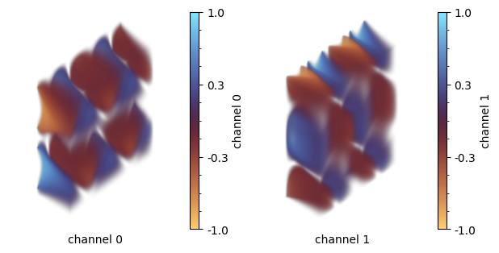

<h1 align="center">
  
  <br>TorchFSM<br>
</h1>
<h4 align="center">Fourier Spectral Method with PyTorch</h4>
<p align="center">
  [<a href="https://qiauil.github.io/torchfsm/"> Documentation & Examples</a>]
</p>

## TL;DR
`TorchFSM` is a PyTorch-based library for solving PDEs using Fourier spectral method. It is designed for physics-based deep learning and differentiable simulations.

## Simple Example
Build a Burger equation with provided operators (the Burgers equation is also available at `torchfsm.pde`):
```python
from torchfsm.operator import Operator, Convection, Laplacian

def Burgers(nu:float) -> Operator:
    return nu*Laplacian()-Convection()
burgers=Burgers(0.01)
```
Simulate the Burgers equation at 1D mesh:
```python
from torchfsm.mesh import MeshGrid
from torchfsm.plot import plot_traj
from torchfsm.traj_recorder import AutoRecorder
import torch

device='cuda' if torch.cuda.is_available() else 'cpu'
L=1.0; N=128; 
mesh=MeshGrid([(0,L,N)],device=device)
x=mesh.bc_mesh_grid()
u_0=torch.sin(2*torch.pi*x/L)+0.5

traj=burgers.integrate(u_0=u_0,mesh=mesh,
    dt=0.01,step=200,
    trajectory_recorder=AutoRecorder(),
)
plot_traj(traj,animation=False,cmap="managua")
```


Directly simulate the Burgers on 2D mesh with the same operator:
```python
mesh=MeshGrid([(0,L,N),(0,L,N)],device=device)
x,y=mesh.bc_mesh_grid()
u_0=torch.cat([torch.sin(2*torch.pi*x/L)*torch.cos(4*torch.pi*y/L),
               torch.cos(2*torch.pi*x/L)*torch.sin(4*torch.pi*y/L)],
              dim=1)

traj=burgers.integrate(u_0=u_0,mesh=mesh,
    dt=0.01,step=50,
    trajectory_recorder=AutoRecorder(),
)

plot_traj(traj,animation=False,cmap="managua")
```

## Feature

* **Modular by design**: TorchFSM offers a modular architecture with essential mathematical operators—like divergence, gradient, and convection—so you can build custom solvers like stacking building blocks, quickly and intuitively.

* **GPU-accelerated**: TorchFSM leverages GPU computing to speed up simulations dramatically. Run complex 3D PDEs in minutes, not hours, with seamless hardware acceleration.

* **Batched simulation support**: Built on PyTorch, TorchFSM enables batched simulations with varied initial conditions—ideal for parameter sweeps, uncertainty quantification, or ensemble analysis.

* **Differentiable and ML-ready**: Fully differentiable by design, TorchFSM integrates naturally with machine learning workflows—for residual operators, differentiable physics, or dataset generation.

## Installation

* Install through pip: `pip install torchfsm`
* Install the latest version through pip: `pip install git+https://github.com/qiauil/torchfsm`
* Install locally: Download the repository and run `pip install .`

## Documentations

Check 👉 [here](https://qiauil.github.io/torchfsm/).

## Citation

We will be happy if you use `TorchFSM` in your research. If you find our work useful, please consider citing our repository:

```
@software{liu_2025_15350210,
  author       = {Liu, Qiang and
                  Koehler, Felix and
                  Thuerey, Nils},
  title        = {TorchFSM: Fourier Spectral Method with PyTorch},
  month        = may,
  year         = 2025,
  publisher    = {Zenodo},
  doi          = {10.5281/zenodo.15350210},
  url          = {https://doi.org/10.5281/zenodo.15350210},
}
```

## Further Information

* `TorchFSM` is mainly built by <a href="https://qiauil.github.io/">Qiang Liu</a>, <a href="https://fkoehler.site/">Felix Koehler</a>, and <a href="https://ge.in.tum.de/about/n-thuerey/">Nils Thuerey</a> at <a href="https://ge.in.tum.de">Physics Based Simulation Group, Technical University of Munich</a>  </h6>
* If you are more familiar with Jax, please check our Jax alternative [Exponax](https://github.com/Ceyron/exponax)