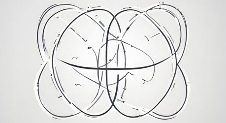
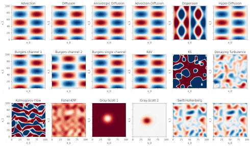

<h1 align="center">
  
  <br>
    Exponax
  <br>
</h1>

<h4 align="center">Efficient Differentiable PDE solvers built on top of <a href="https://github.com/google/jax" target="_blank">JAX</a> & <a href="https://github.com/patrick-kidger/equinox" target="_blank">Equinox</a>.</h4>

<p align="center">
  <a href="#installation">Installation</a> •
  <a href="#quickstart">Quickstart</a> •
  <a href="#features">Features</a> •
  <a href="#documentation">Documentation</a> •
  <a href="#background">Background</a> •
  <a href="#related">Related</a> •
  <a href="#license">License</a>
</p>

<p align="center">
    
</p>

## Installation

```bash
pip install git+ssh://git@github.com/Ceyron/exponax@main
```

Requires Python 3.10+ and JAX 0.4.13+ (and Equinox & Matplotlib). 👉 [JAX install guide](https://jax.readthedocs.io/en/latest/installation.html).

## Quickstart

1d Kuramoto-Sivashinsky Equation.

```python
import jax
import exponax as ex
import matplotlib.pyplot as plt

ks_stepper = ex.stepper.KuramotoSivashinskyConservative(
    num_spatial_dims=1, domain_extent=100.0,
    num_points=200, dt=0.1,
)

u_0 = ex.ic.RandomTruncatedFourierSeries(
    num_spatial_dims=1, cutoff=5
)(num_points=200, key=jax.random.PRNGKey(0))

trajectory = ex.rollout(ks_stepper, 500, include_init=True)(u_0)

plt.imshow(trajectory[:, 0, :].T, aspect='auto', cmap='RdBu', vmin=-2, vmax=2, origin="lower")
plt.xlabel("Time"); plt.ylabel("Space"); plt.show()
```


For a next step, check out the [simple_advection_example_1d.ipynb](examples/simple_advection_example_1d.ipynb) notebook in the `examples` folder, and check out the <a href="#documentation">Documentation</a>.

## Features


1. **JAX** as the computational backend:
    1. **Backend agnotistic code** - run on CPU, GPU, or TPU, in both single and
        double precision.
    2. **Automatic differentiation** over the timesteppers - compute gradients
        of solutions with respect to initial conditions, parameters, etc.
    3. Also helpful for **tight integration with Deep Learning** since each
        timestepper is just an
        [Equinox](https://github.com/patrick-kidger/equinox) Module.
    4. **Automatic Vectorization** using `jax.vmap` (or `equinox.filter_vmap`)
        allowing to advance multiple states in time or instantiate multiple
        solvers at a time that operate efficiently in batch.
2. **Lightweight Design** without custom types. There is no `grid` or `state`
    object. Everything is based on `jax.numpy` arrays. Timesteppers are callable
    PyTrees.
3. More than 35 pre-built dynamics:
    1. Linear PDEs in 1d, 2d, and 3d (advection, diffusion, dispersion, etc.)
    2. Nonlinear PDEs in 1d, 2d, and 3d (Burgers, Kuramoto-Sivashinsky,
        Korteweg-de Vries, Navier-Stokes, etc.)
    3. Reaction-Diffusion (Gray-Scott, Swift-Hohenberg, etc.)
4. Collection of initial condition distributions (truncated Fourier series,
   Gaussian Random Fields, etc.)
5. **Utilities** for spectral derivatives, grid creation, autogressive rollout,
   etc.
6. Easily extendable to new PDEs by subclassing from the `BaseStepper` module.
7. Normalized interface for reduced number of parameters to uniquely define any
   dynamics.

## Documentation

The following Jupyter notebooks showcase the usage of the package:

1. [Simple Advection Example in 1d](docs/examples/simple_advection_example_1d.ipynb)
2. ...

The documentation is still in progress. For now, the best way to get started is
to look at the examples and the docstrings in the code.

## Background

Exponax supports the efficient solution of (semi-linear) partial differential
equations on periodic domains in arbitrary dimensions. Those are PDEs of the
form

$$ \partial u/ \partial t = Lu + N(u) $$

where $L$ is a linear differential operator and $N$ is a nonlinear differential
operator. The linear part can be exactly solved using a (matrix) exponential,
and the nonlinear part is approximated using Runge-Kutta methods of various
orders. These methods have been known in various disciplines in science for a
long time and have been unified for a first time by [Cox &
Matthews](https://doi.org/10.1006/jcph.2002.6995) [1]. In particular, this
package uses the complex contour integral method of [Kassam &
Trefethen](https://doi.org/10.1137/S1064827502410633) [2] for numerical
stability. The package is restricted to the original first, second, third and
fourth order method. A recent study by [Montanelli &
Bootland](https://doi.org/10.1016/j.matcom.2020.06.008) [3] showed that the
original *ETDRK4* method is still one of the most efficient methods for these
types of PDEs.

We focus on periodic domains on scaled hypercubes with a uniform Cartesian
discretization. This allows using the Fast Fourier Transform resulting in
blazing fast simulations. For example, a dataset of trajectories for the 2d
Kuramoto-Sivashinsky equation with 50 initial conditions over 200 time steps
with a 128x128 discretization is created in less than a second on a modern GPU.

[1] Cox, Steven M., and Paul C. Matthews. "Exponential time differencing for stiff systems." Journal of Computational Physics 176.2 (2002): 430-455.

[2] Kassam, A.K. and Trefethen, L.N., 2005. Fourth-order time-stepping for stiff PDEs. SIAM Journal on Scientific Computing, 26(4), pp.1214-1233.

[3] Montanelli, Hadrien, and Niall Bootland. "Solving periodic semilinear stiff PDEs in 1D, 2D and 3D with exponential integrators." Mathematics and Computers in Simulation 178 (2020): 307-327.


## Related

This package is greatly inspired by the [chebfun](https://www.chebfun.org/)
library in *MATLAB*, in particular the
[`spinX`](https://www.chebfun.org/docs/guide/guide19.html) (Stiff Pde INtegrator
in X dimensions) module within it. These *MATLAB* utilties have been used
extensively as a data generator in early works for supervised physics-informed
ML, e.g., the
[DeepHiddenPhysics](https://github.com/maziarraissi/DeepHPMs/tree/7b579dbdcf5be4969ebefd32e65f709a8b20ec44/Matlab)
and [Fourier Neural
Operators](https://github.com/neuraloperator/neuraloperator/tree/af93f781d5e013f8ba5c52baa547f2ada304ffb0/data_generation)
(the links show where in their public repos they use the `spinX` module). The
approach of pre-sampling the solvers, writing out the trajectories, and then
using them for supervised training worked for these problems, but of course
limits the scope to purely supervised problem. Modern research ideas like
correcting coarse solvers (see for instance the [Solver-in-the-Loop
paper](https://arxiv.org/abs/2007.00016) or the [ML-accelerated CFD
paper](https://arxiv.org/abs/2102.01010)) requires the coarse solvers to be
[differentiable](https://physicsbaseddeeplearning.org/diffphys.html). Some ideas
of diverted chain training also requires the fine solver to be differentiable!
Even for applications without differentiable solvers, we still have the
**interface problem** with legacy solvers (like the *MATLAB* ones). Hence, we
cannot easily query them "on-the-fly" for sth like active learning tasks, nor do
they run efficiently on hardward accelerators (GPUs, TPUs, etc.). Additionally,
they were not designed with batch execution (in the sense of vectorized
application) in mind which we get more or less for free by `jax.vmap`. With the
reproducible randomness of `JAX` we might not even have to ever write out a
dataset and can re-create it in seconds!

This package also took much inspiration from the
[FourierFlows.jl](https://github.com/FourierFlows/FourierFlows.jl) in the
*Julia* ecosystem, especially for checking the implementation of the contour
integral method of [2] and how to handle (de)aliasing.


## License

MIT, see [here](LICENSE.txt)

---

> [fkoehler.site](https://fkoehler.site/) &nbsp;&middot;&nbsp;
> GitHub [@ceyron](https://github.com/ceyron) &nbsp;&middot;&nbsp;
> X [@felix_m_koehler](https://twitter.com/felix_m_koehler)
