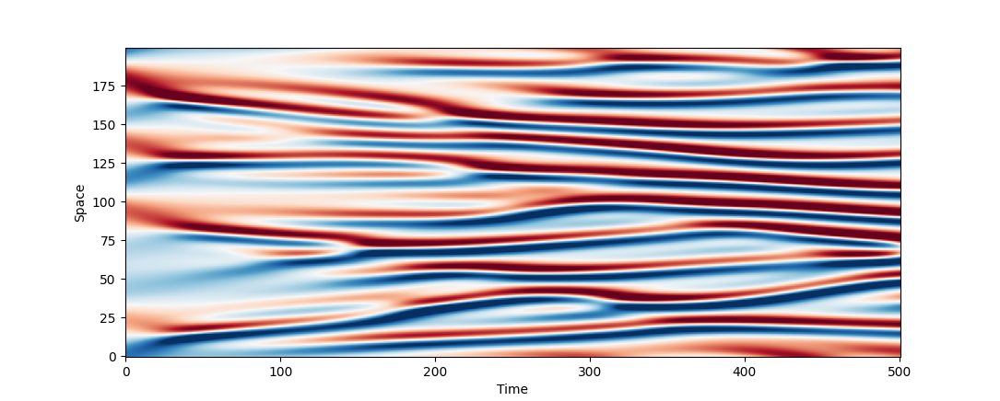

# Getting Started

## Installation

```bash
pip install git+ssh://git@github.com/Ceyron/exponax@main
```

## Quickstart

1d Kuramoto-Sivashinsky Equation.

```python
import jax
import exponax as ex
import matplotlib.pyplot as plt

ks_stepper = ex.stepper.KuramotoSivashinskyConservative(
    num_spatial_dims=1, domain_extent=100.0,
    num_points=200, dt=0.1,
)

u_0 = ex.ic.RandomTruncatedFourierSeries(
    num_spatial_dims=1, cutoff=5
)(num_points=200, key=jax.random.PRNGKey(0))

trajectory = ex.rollout(ks_stepper, 500, include_init=True)(u_0)

plt.imshow(trajectory[:, 0, :].T, aspect='auto', cmap='RdBu', vmin=-2, vmax=2, origin="lower")
plt.xlabel("Time"); plt.ylabel("Space"); plt.show()
```



For a next step, check out the [simple_advection_example_1d.ipynb](examples/simple_advection_example_1d.ipynb) notebook in the `examples` folder, and check out the <a href="#documentation">Documentation</a>.

## Features


1. **JAX** as the computational backend:
    1. **Backend agnotistic code** - run on CPU, GPU, or TPU, in both single and
        double precision.
    2. **Automatic differentiation** over the timesteppers - compute gradients
        of solutions with respect to initial conditions, parameters, etc.
    3. Also helpful for **tight integration with Deep Learning** since each
        timestepper is just an
        [Equinox](https://github.com/patrick-kidger/equinox) Module.
    4. **Automatic Vectorization** using `jax.vmap` (or `equinox.filter_vmap`)
        allowing to advance multiple states in time or instantiate multiple
        solvers at a time that operate efficiently in batch.
2. **Lightweight Design** without custom types. There is no `grid` or `state`
    object. Everything is based on `jax.numpy` arrays. Timesteppers are callable
    PyTrees.
3. More than 35 pre-built dynamics:
    1. Linear PDEs in 1d, 2d, and 3d (advection, diffusion, dispersion, etc.)
    2. Nonlinear PDEs in 1d, 2d, and 3d (Burgers, Kuramoto-Sivashinsky,
        Korteweg-de Vries, Navier-Stokes, etc.)
    3. Reaction-Diffusion (Gray-Scott, Swift-Hohenberg, etc.)
4. Collection of initial condition distributions (truncated Fourier series,
   Gaussian Random Fields, etc.)
5. **Utilities** for spectral derivatives, grid creation, autogressive rollout,
   etc.
6. Easily extendable to new PDEs by subclassing from the `BaseStepper` module.
7. Normalized interface for reduced number of parameters to uniquely define any
   dynamics.


## License

MIT, see [here](https://github.com/Ceyron/apebench/blob/main/LICENSE.txt)

---

> [fkoehler.site](https://fkoehler.site/) &nbsp;&middot;&nbsp;
> GitHub [@ceyron](https://github.com/ceyron) &nbsp;&middot;&nbsp;
> X [@felix_m_koehler](https://twitter.com/felix_m_koehler)
